```{r setup, include=FALSE}
options(htmltools.dir.version = FALSE)
library(knitr)
knitr::opts_chunk$set(warning = FALSE, message = FALSE)
# options(knitr.table.format = "html")
library(tidyverse)
library(babynames)
library(fontawesome) # from github: https://github.com/rstudio/fontawesome
library(DiagrammeR)
library(plotly)
library(tmap)
library(sf)
library(hrbrthemes)
library(DT)
```


```{r message=FALSE, warning=FALSE, include=FALSE}
library(readr)
warehouse <- read_delim("D:/google_drive/01_postdoc/06_documents/final_delivery/data/warehouse.csv", 
    ";", escape_double = FALSE, locale = locale(decimal_mark = ",", 
        grouping_mark = "."), trim_ws = TRUE)

metro <- read_delim("D:/google_drive/02_pesquisa/04_eventos/2021/congressos/4VREF/data/metro_data_cluster.csv", 
    ";", escape_double = FALSE, locale = locale(decimal_mark = ",", 
        grouping_mark = "."), trim_ws = TRUE)

bin_data <- read_delim("data/all_wh_class_bin.csv", 
    ";", escape_double = FALSE, locale = locale(decimal_mark = ",", 
        grouping_mark = "."), trim_ws = TRUE)

cluster_metro <- read_delim("D:/google_drive/02_pesquisa/04_eventos/2021/congressos/4VREF/data/cluster_metro.csv", 
    ";", escape_double = FALSE, locale = locale(decimal_mark = ",", 
        grouping_mark = "."), trim_ws = TRUE)


norm_minmax <- function(x){
                           (x- min(x)) /(max(x)-min(x))
}
```

layout: true
  
<div class="my-footer"><span>retaoliveira.github.io/places</span></div>

<!-- this adds the link footer to all slides, depends on my-footer class in css-->

---
name: xaringan-title
class: left, middle
background-image: url(img/log7.jpg)
background-size: cover

.beige[
.larger[
Relationships among urban characteristics, real estate market and spatial patterns of warehouses in different geographic contexts
]
]

.beige[
Renata Oliveira | 4th VREF | 2021-03-24
]


<!-- this ends up being the title slide since seal = FALSE-->

---

# Authors


```{r echo=FALSE, fig.align='center', message=FALSE, warning=FALSE, out.width='90%'}
knitr::include_graphics('img/banner.png')
```

.center[
.large[
Renata Oliveira   
Laetita Dablanc   
Matthieu Schorung   
Laura Palacios-Arguello   
]
]
---

# Logistics Sprawl


.justify[
Urban land and floor space scarcity and economies of scale have .pink[relocated logistics facilities towards less dense and more peripheral areas] of cities, this process, known as **'logistics sprawl'**, has compromised urban sustainability, livability, and economic growth*. 
]

--

Outsourcing of logistics activities


--

Urban logistics real estate market. 


.pull-right-narrow[
.tiny[
Dablanc and Rakotonarivo (2010)   
Dablanc, Ogilvie, Goodchild (2014)   
Dablanc, Browne (2019)   
Heitz, Dablanc, Tavasszy (2017)   
Cidell (2010)   
Sakai, Beziat, Heitz (2020)   
]
]

---

# Research hypotheses
.large[
Land/rent values are higher in central areas than in the periphery of cities (concerning the CBD or local central places)
]

<hr>
--
.large[
Logistics sprawl is related to land/rent values of logistics facilities.
]

---

background-image: url(img/log3.jpg)
background-size: cover

# Objectives


.pull-left[
.left[
.big[
**Compare worldwide metropolitan regions considering the relationships among urban attributes, logistics real estate, and logistics facilities' spatial structure focusing on logistics sprawl.**
]
]
]

---

class: middle, inverse

# Methodological approach 

---

# Methodological approach 

```{r echo=FALSE, message=FALSE, warning=FALSE}
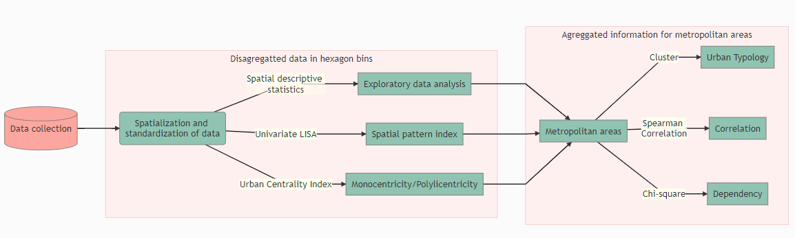
```

---

# Methodological approach 

```{r echo=FALSE, message=FALSE, warning=FALSE}
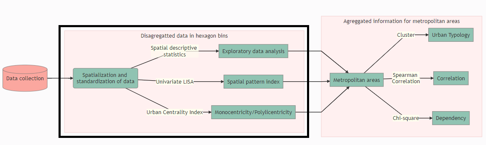
```

---

# Methodological approach

**Spatial descriptive statistics**

.pull-left[
.small[
Urban Classification

Classification|	Category
--------------|---------
Lower outlier	|Suburban
< 25 %|	Suburban
25 % - 50 %	|Pericentral
50 % - 75%	|Pericentral
> 75 %	| Central
Upper outlier	| Central
]
]

.pull-right[

.small[
Warehouse location and rent prices

Classification|	Category
--------------|---------
Lower extreme|	Extremely low
Lower outlier|	Very low
< 25 %|Low
25 % - 50 %|	Medium
50 % - 75%|	Medium
> 75 %	|High
Upper outlier|	 Very high
Upper extreme	|Extremely high
]
]


---

# Methodological approach 

**Spatial pattern index**

**Univariate Global and Local Moran's I** - spatial autocorrelation. 

LISA map generated considering a 0.05 level of significance and a Monte Carlo simulation (2000 permutations).  

---

# Methodological approach 

**Urban Centrality Index (UCI)***

Computed considering: 
- **location coefficient** - measure the unequal distribution factor of the urban intensity index within each urban area
- **spatial separation index**, namely Venables index, which aims at evaluating the spatial distribution of spatial patterns of activities; and
- **proximity index**, which is the normalization of the Venables index considering the respective maximum attainable value. The UCI values range from 0 to 1, where 0 the most polycentric area and 1, maximal monocentricity. 

.pull-right-narrow[
.small[
*Pereira (2013)
]
]

---

# Methodological approach 

**Dataset containing all hex bins for all the metropolitan regions investigated**
.midi[
-	Number of warehouses in each hex bin
-	Average warehouse price in each hex bin
-	Urban intensity index
-	Spatial cluster identification for urban intensity index and warehouse count and rent prices
-	Classification and outlier’s identification for warehouse count and rent prices
]


---

# Methodological approach 


```{r echo=FALSE, message=FALSE, warning=FALSE, out.width="200%"}
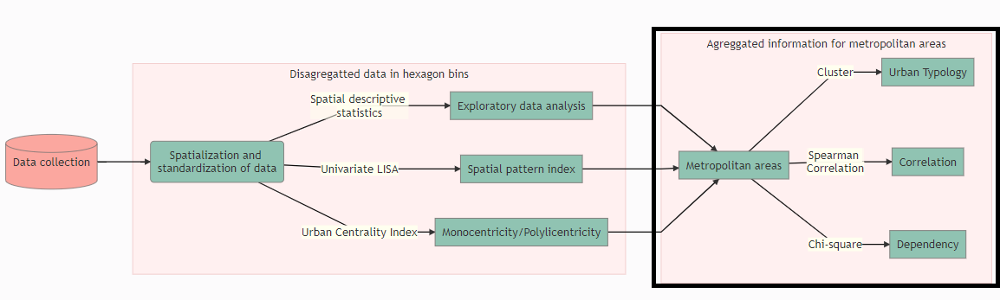
```

---

# Methodological approach 

**Dataset containing the indicators for each metropolitan region**
.midi[
-	Global Moran’s I index for road extension spatial distribution
-	Global Moran’s I index for urban intensity index
-	Global Moran’s I index for warehouse spatial distribution
-	Global Moran’s I index for warehouse rent prices distribution
-	UCI for urban intensity index
-	UCI for warehouse location
-	Population (t0 and t1)
-	Metropolitan territorial area
-	Number of municipalities
-	Number of warehouses (t0 and t1)
-	Average distance to barycenter (t0 and t1)
-	Binary variable for logistics sprawl
-	The proportion of HH, HL, LH and LL clusters for the urban activity index, warehouse location and warehouse price.
]

---

# Methodological approach 

**Typology** - K-means cluster analysis

.center[
.green[
Can we gather all metropolitan regions into one comparative analysis?
]
]

**Dependence** of warehouse location and prices on urban activity - Chi-square test of independence

.center[
.green[
Do warehouse location and prices depend on urban activity?
]
]

**Correlation** among continuous variables - Spearman correlation

.center[
.green[
Is logistics sprawl related to warehouse rental prices? 
]
]

---

class: middle, inverse

# Results

---

```{r message=FALSE, warning=FALSE, include=FALSE}
#ware_sf <- st_as_sf(warehouse, coords = c("lon", "lat"), crs = 4326)
#world <- read_sf("shape/99bfd9e7-bb42-4728-87b5-07f8c8ac631c2020328-1-1vef4ev.lu5nk.shp")

#ggplot(ware_sf) +
 # geom_sf()

warehouse$q <- with(warehouse, cut(size, quantile(size)))
levels(warehouse$q) <- paste(c("1st", "2nd", "3rd", "4th", "5th"), "Quantile")
warehouse$q <- as.ordered(warehouse$q)

g <- list(
  scope = 'world',
  projection = list(type = 'wgs84'),
  showland = TRUE,
  showlakes = FALSE,
  showsubunits = TRUE,
  showcountries = TRUE,
  landcolor = toRGB("white"),
  subunitcolor = toRGB("gray"),
  countrycolor = toRGB("gray"),
  countrywidth = 0.5,
  subunitwidth = 0.5
)

p3 <- warehouse %>%
  plot_geo(lat = ~lat, lon = ~lon, mode = 'markers', hoverinfo= "text", size = ~price, color = ~country) %>%
  add_markers(size = ~price, color = ~country, colors = c('#e41a1c','#377eb8','#4daf4a','#984ea3','#ff7f00','#ffff33','#a65628','#f781bf','#6a3d9a'), text = ~paste(warehouse$metro, "<br />", warehouse$price), opacity = 1, marker=list(sizeref=0.5, sizemode="area")) %>% 
  layout(font =list(color='black'), geo = g, legend = list(x = 0.05, y = 0.2))

p3


htmlwidgets::saveWidget(as.widget(p3), file = "img/map.html")

```

```{r message=FALSE, warning=FALSE, include=FALSE}
all <- bin_data %>% 
  filter(class_wh != "no warehouse"| class_wh_price != "no warehouse") %>% 
  mutate(n_cont_wh = norm_minmax(cont_wh), n_wh_vg_p = norm_minmax(wh_vg_p))

y1 <- list(
  title = "Number of warehouses"
)

y2 <- list(
  title = "Warehouse average price"
)


box1 <- plot_ly(all, y = ~cont_wh, color = ~class, type = "box", boxpoints = 'all')
box1 <- box1 %>% layout(yaxis = y1)

box1


htmlwidgets::saveWidget(as.widget(box1), file = "img/box1.html")


box2 <- plot_ly(all, y = ~wh_vg_p, color = ~class, type = "box", boxpoints = 'all')
box2 <- box2 %>% layout(yaxis = y2)

box2


htmlwidgets::saveWidget(as.widget(box2), file = "img/box2.html")

```

```{r message=FALSE, warning=FALSE, include=FALSE}

all_cluster <- bin_data %>% 
  filter(class_wh != "no warehouse"| class_wh_price != "no warehouse") %>% 
  mutate(n_cont_wh = norm_minmax(cont_wh), n_wh_vg_p = norm_minmax(wh_vg_p)) %>% 
  left_join(cluster_metro, by = "metro_name")

wh_class_price <- all_cluster %>%
  select(metro_name, class, cont_wh, wh_vg_p, cluster) %>% 
  filter(!is.na(cluster)) %>% 
  group_by(class, cluster) %>% 
  summarise(count = n(), price = mean(wh_vg_p))

class_price_cluster <- all_cluster %>%
  select(metro_name, class, cont_wh, wh_vg_p, cluster) %>% 
  filter(!is.na(cluster)) %>% 
  group_by(cluster) %>% 
  summarise(count = n(), price = mean(wh_vg_p))

wh_class_price_all <- all_cluster %>%
  select(metro_name, class, cont_wh, wh_vg_p, cluster) %>% 
  filter(!is.na(cluster)) %>% 
  group_by(class) %>% 
  summarise(count = n(), price = mean(wh_vg_p))

incremental <- wh_class_price_all %>% 
  bind_rows(wh_class_price) 

names(incremental) <- c("Urban classification", "number of warehouses", "US$/m2/year", "Cluster")

y1 <- list(
  title = "Number of warehouses"
)

y2 <- list(
  title = "Warehouse average price"
)

box1 <- plot_ly(all, y = ~cont_wh, color = ~class, type = "box", boxpoints = 'all')
box1 <- box1 %>% layout(yaxis = y1)
box1
htmlwidgets::saveWidget(as.widget(box1), file = "img/box1.html")

x1 <- all_cluster %>% filter(cluster == 1)
x2 <- all_cluster %>% filter(cluster == 2)
x3 <- all_cluster %>% filter(cluster == 3)
x4 <- all_cluster %>% filter(cluster == 4)


box1_1 <- plot_ly(x1, y = ~cont_wh, color = ~class, type = "box", boxpoints = 'all')
box1_1 <- box1_1 %>% layout(yaxis = y1, title = "Cluster 1")
box1_1
htmlwidgets::saveWidget(as.widget(box1_1), file = "img/box1_1.html")

box1_2 <- plot_ly(x2, y = ~cont_wh, color = ~class, type = "box", boxpoints = 'all')
box1_2 <- box1_2 %>% layout(yaxis = y1, title = "Cluster 2")
box1_2
htmlwidgets::saveWidget(as.widget(box1_2), file = "img/box1_2.html")

box1_3 <- plot_ly(x3, y = ~cont_wh, color = ~class, type = "box", boxpoints = 'all')
box1_3 <- box1_3 %>% layout(yaxis = y1, title = "Cluster 3")
box1_3
htmlwidgets::saveWidget(as.widget(box1_3), file = "img/box1_3.html")

box1_4 <- plot_ly(x4, y = ~cont_wh, color = ~class, type = "box", boxpoints = 'all')
box1_4 <- box1_4 %>% layout(yaxis = y1, title = "Cluster 4")
box1_4
htmlwidgets::saveWidget(as.widget(box1_4), file = "img/box1_4.html")

box2 <- plot_ly(all, y = ~wh_vg_p, color = ~class, type = "box", boxpoints = 'all')
box2 <- box2 %>% layout(yaxis = y2)
box2
htmlwidgets::saveWidget(as.widget(box2), file = "img/box2.html")

box2_1 <- plot_ly(x1, y = ~wh_vg_p, color = ~class, type = "box", boxpoints = 'all')
box2_1 <- box2_1 %>% layout(yaxis = y2, title = "Cluster 1")
box2_1
htmlwidgets::saveWidget(as.widget(box2_1), file = "img/box2_1.html")

box2_2 <- plot_ly(x2, y = ~wh_vg_p, color = ~class, type = "box", boxpoints = 'all')
box2_2 <- box2_2 %>% layout(yaxis = y2, title = "Cluster 2")
box2_2
htmlwidgets::saveWidget(as.widget(box2_2), file = "img/box2_2.html")

box2_3 <- plot_ly(x3, y = ~wh_vg_p, color = ~class, type = "box", boxpoints = 'all')
box2_3 <- box2_3 %>% layout(yaxis = y2, title = "Cluster 3")
box2_3
htmlwidgets::saveWidget(as.widget(box2_3), file = "img/box2_3.html")

box2_4 <- plot_ly(x4, y = ~wh_vg_p, color = ~class, type = "box", boxpoints = 'all')
box2_4 <- box2_4 %>% layout(yaxis = y2, title = "Cluster 4")
box2_4
htmlwidgets::saveWidget(as.widget(box2_4), file = "img/box2_4.html")
```


# Results

```{r message=FALSE, warning=FALSE, include=FALSE}
sprawl <- metro %>% 
  rowwise() %>% 
  mutate(mymean = mean(c(average_distance_ware_gravity_t1,average_distance_ware_gravity_t0), na.rm = TRUE)) %>% 
  arrange(desc(mymean)) %>% 
  mutate(x=factor(metro_name)) %>% 
  filter(average_distance_ware_gravity_t0 != 0 & average_distance_ware_gravity_t1 !=0) %>% 
  dplyr::select(x, mymean, "average_distance_ware_gravity_t0", "average_distance_ware_gravity_t1")

```

```{r message=FALSE, warning=FALSE, include=FALSE}

espraia <- plot_ly(sprawl,
                    color = I("gray80")) %>% 
  add_segments(y = ~x, 
               yend = ~x, 
               x = ~average_distance_ware_gravity_t1, 
               xend = ~average_distance_ware_gravity_t0, 
               showlegend = FALSE) %>% 
  add_markers(y = ~x, 
              x = ~average_distance_ware_gravity_t0, 
              name = "t0", 
              color = I("#EE576B")) %>% 
  add_markers(y = ~x, 
              x = ~average_distance_ware_gravity_t1, 
              name = "t1", 
              color = I("#245468")) %>% 
  layout(title = "",
         xaxis = list(title = "Average distance to Barycenter (km)"),
         yaxis = list(title = "Metropolitan area", autorange = "reversed"),
         margin = list(l = 65))

htmlwidgets::saveWidget(as.widget(espraia), file = "img/espraia.html")

```


<iframe src="img/espraia.html" style="height:550px;width:1900px;" frameborder="0"></iframe>

---

```{r echo=FALSE, message=FALSE, warning=FALSE, out.width="120%", fig.align='center'}
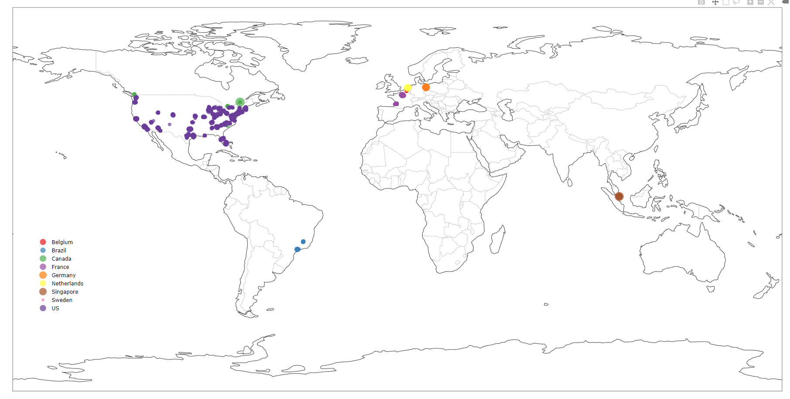
```

---

# Results

```{r echo=FALSE, message=FALSE, warning=FALSE, out.width="70%", fig.align='center'}
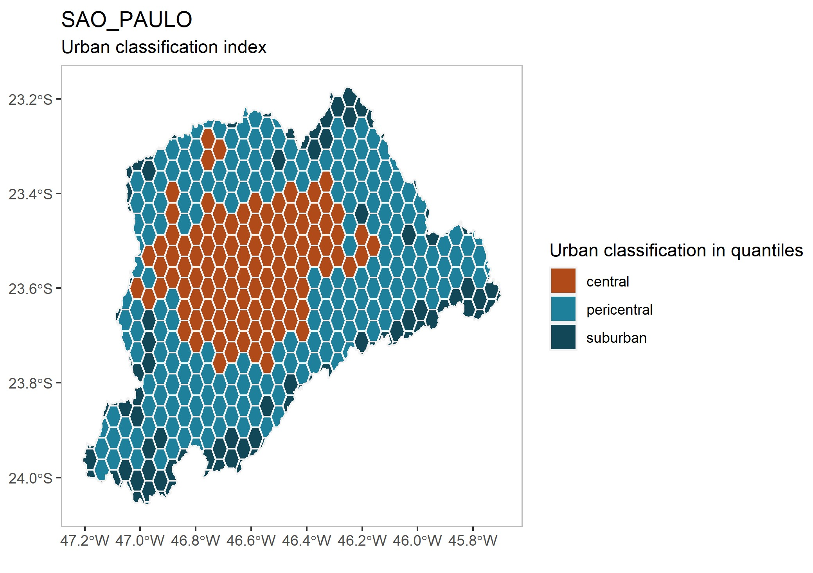
```

---

# Results

.pull-left[
```{r echo=FALSE, message=FALSE, warning=FALSE, out.width="120%", fig.align='center'}
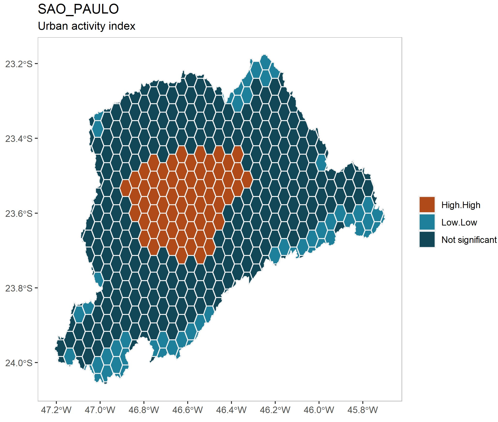
```
]

.pull-right[
```{r echo=FALSE, message=FALSE, warning=FALSE, out.width="120%", fig.align='center'}
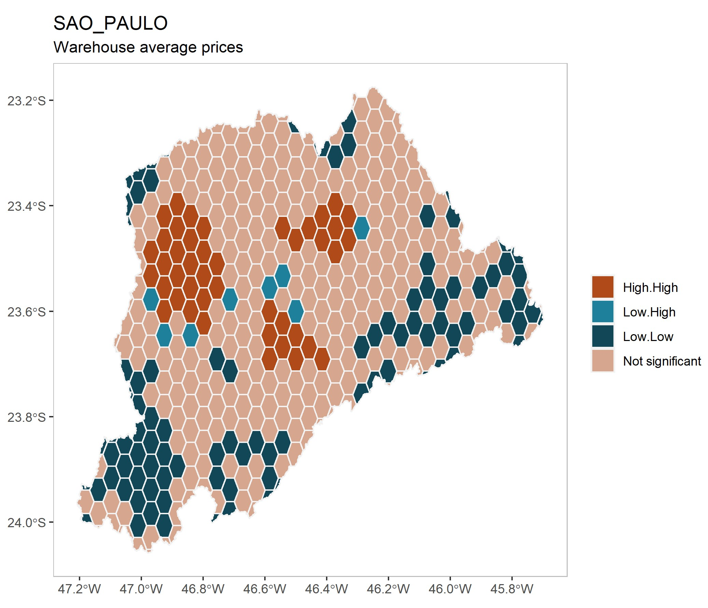
```
]

---

# Results

.pull-left-narrow[
```{r echo=FALSE, message=FALSE, warning=FALSE, out.width="120%", fig.align='center'}
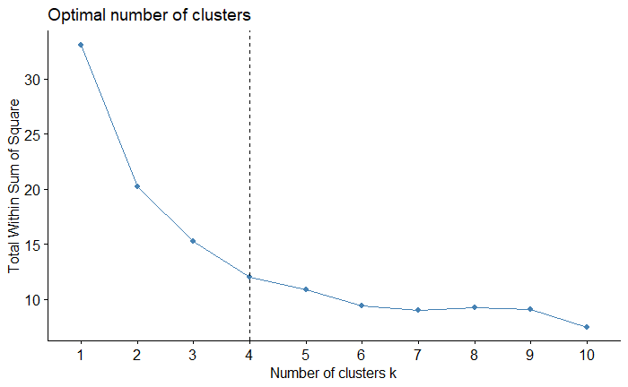
```

Assumption:   
FOUR CLUSTERS

]

.pull-right-wide[
```{r echo=FALSE, message=FALSE, warning=FALSE, out.width="150%", fig.align='center'}
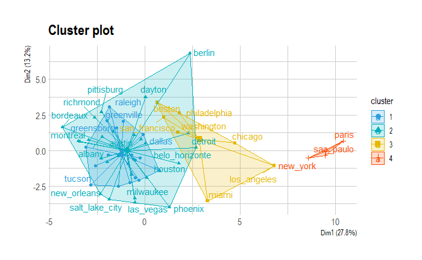
```
]


---

# Results

**Can we gather all metropolitan regions into one comparative analysis?**

.midi[
Attribute|	C1|	C2|	C3|	C4
---------|----|---|---|----
Urban activity - Clustered spatial pattern| ++|	+	|++|	+++
Urban activity - Polycentricity|	++|	+++|	+	|+++
Warehouse location - Clustered spatial pattern| ++|	++|	++|	+++
Warehouse location - Polycentricity|	+|	+	|++	|+++
Population|	+|	+|+++|++++
Area|	+	|++	|+++|	++++
Municipalities|	+	|+++|	++|	++++
Logistics Sprawl|	 +|+++|+++|	++
Warehouse real estate prices - Clustered spatial pattern |++ |++ |++ |+++
]

---

**Do warehouse location depend on urban activity?**

<iframe src="img/box1.html" style="height:500px;width:2100px;" frameborder="0"></iframe>

---

**Do warehouse prices depend on urban activity?**

<iframe src="img/box2.html" style="height:500px;width:2100px;" frameborder="0"></iframe>

---

**Do warehouse location and prices depend on urban activity?**
.pull-left[
```{r echo=FALSE, message=FALSE, warning=FALSE, out.width="100%", fig.align='center'}
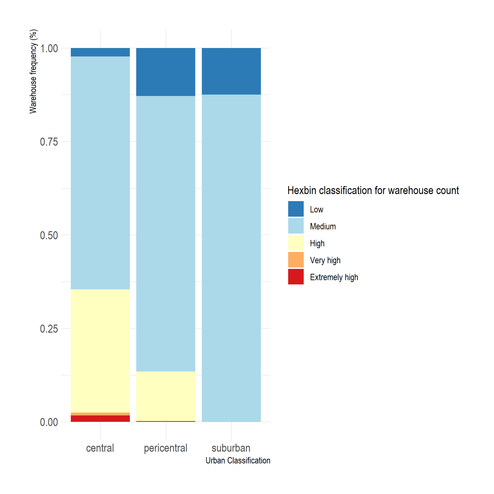
```
]

.pull-right[
```{r echo=FALSE, message=FALSE, warning=FALSE, out.width="100%", fig.align='center'}
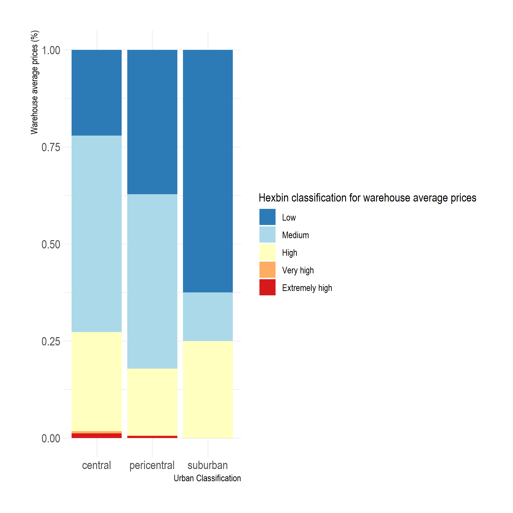
```
]


---

**Economies of agglomeration?**

.pull-left[
```{r echo=FALSE, message=FALSE, warning=FALSE, out.width="100%", fig.align='center'}
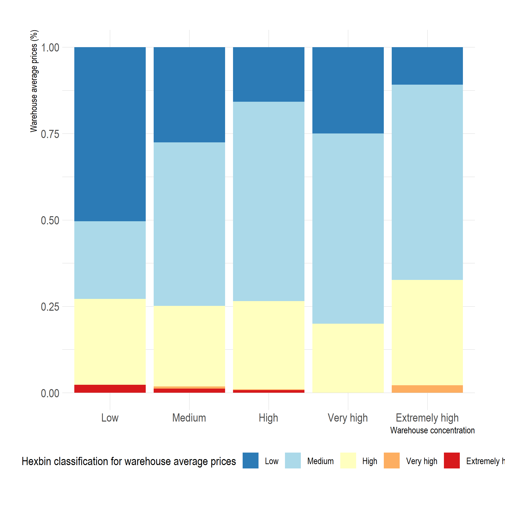
```
]

.pull-right[
.small[
- The higher the concentration of warehouses, the lower the occurrence of bins of low average prices.
]
]
---

**Warehouse concentration and prices among clusters**

.tiny[
```{r echo=FALSE, message=FALSE, warning=FALSE}
incremental %>% 
  arrange(Cluster) %>% 
  knitr::kable(format = "html")
```
]


---

# Results

**Is logistics sprawl related to warehouse rental prices?**

```{r echo=FALSE, message=FALSE, warning=FALSE, out.width="50%", fig.align='center'}
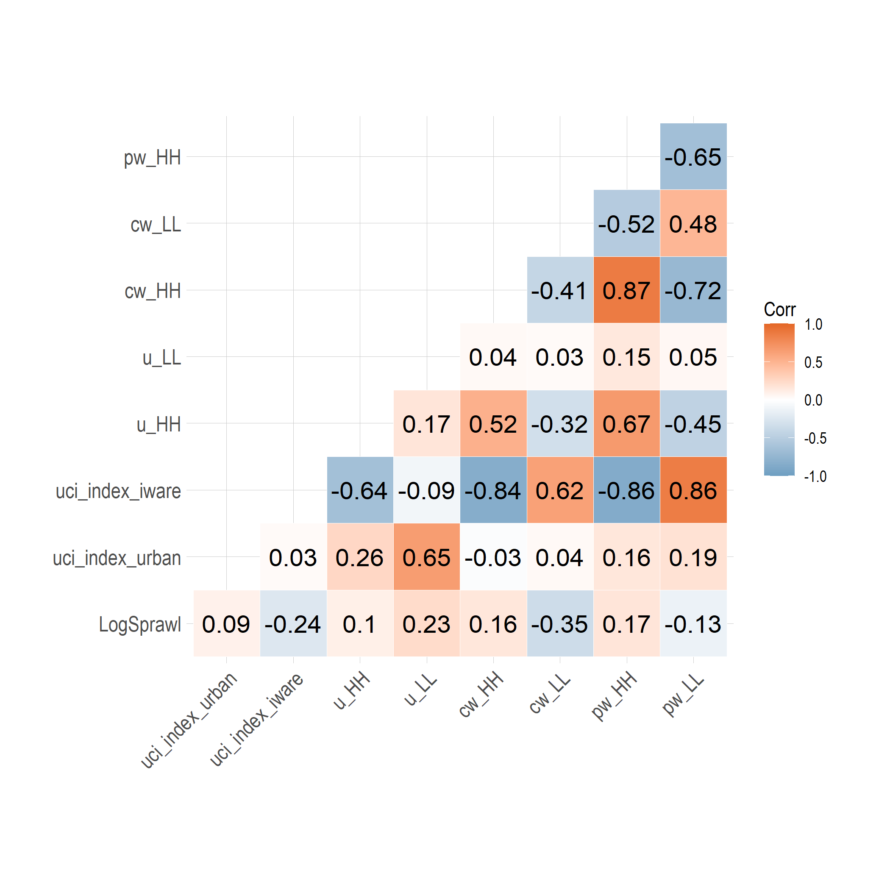
```


---

# Results

**Is logistics sprawl related to warehouse rental prices?**

```{r echo=FALSE, message=FALSE, warning=FALSE, out.width="50%", fig.align='center'}
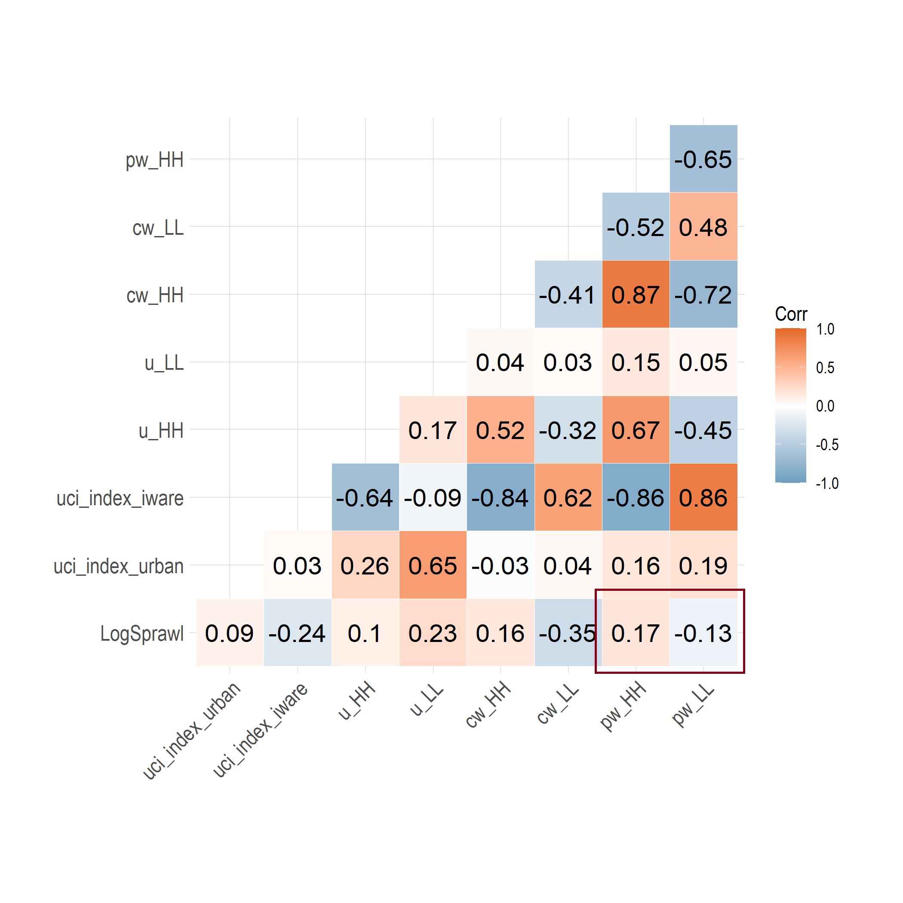
```


---

**Warehouse concentration, prices and logistics sprawl among clusters**

.small[
- For **all categories** of metropolitan areas, there is a more significant **concentration** of warehouses in more **central areas**.

- Considering **all metropolitan areas**, **average warehouse prices decrease** as we move to **more suburban areas**.

- **Warehouse prices** are **higher** in **suburban areas** for **cluster 1** (20% above cluster average), which concerns the metropolitan areas that have had **negative logistics sprawl**, predominantly. These areas present the **lowest average rent prices among clusters**. 

- For **cluster 2**, with metropolitan areas with **significant logistics sprawl**, **suburban prices are 30% lower** than the average of the cluster.

- For **cluster 3**, also presenting **significant logistics sprawl**, **rent prices for pericentral warehouses are 22% cheaper** than the average of the cluster. These areas present the **highest average prices among clusters**.

- **Cluster 4** has a **continuous decrease of prices** the **further** the warehouse is from **central areas**. Pericentral areas have average prices lower than the average of the cluster (-23%) and suburban areas have even lower prices (-51%).
]


---


class: middle, inverse

# Final remarks

---

# Final remarks

.big[
- It is important to classify metropolitan areas into a typology in order to perform comparative studies

- Warehouse location and prices are related to urban activity, but there are differences among metropolitan types

- Logistics sprawl is positively related to warehouse rental prices, but it is not the main factor for locational decisions.
]

---

# Research contributions

**Methodological:** innovative framework for comparing metropolitan regions considering the spatial pattern of logistics facilities and urban characteristics. 

**Reproducibility**

**Public Policy:** Can induce local and regional public authorities to develop more effective public policy addressed to logistics land use and transportation planning. Coordinating these dimensions is essential to support urban logistics stakeholders' needs, cities' livability, and the real estate market.

---

# References

.tiny[
  
[1]	L. Dablanc, D. Rakotonarivo, The impacts of logistics sprawl: How does the location of parcel transport terminals affect the energy efficiency of goods’ movements in Paris and what can we do about it?, Procedia - Soc. Behav. Sci. 2 (2010) 6087–6096. https://doi.org/10.1016/j.sbspro.2010.04.021.
[2]	L. Dablanc, S. Ogilvie, A. Goodchild, Logistics sprawl, Transp. Res. Rec. 2410 (2014) 105–112. https://doi.org/10.3141/2410-12.   
[3]	L. Dablanc, M. Browne, Introduction to special section on logistics sprawl, J. Transp. Geogr. (2019) 0–1.    https://doi.org/10.1016/j.jtrangeo.2019.01.010.   
[4]	A. Heitz, L. Dablanc, L.A. Tavasszy, Logistics sprawl in monocentric and polycentric metropolitan areas: the cases of Paris, France, and the Randstad, the Netherlands, REGION. 4 (2017) 93. https://doi.org/10.18335/region.v4i1.158.   
[5]	J. Cidell, Concentration and decentralization: The new geography of freight distribution in US metropolitan areas, J. Transp. Geogr. 18 (2010) 363–371. https://doi.org/10.1016/j.jtrangeo.2009.06.017.   
[6]	T. Sakai, A. Beziat, A. Heitz, Location factors for logistics facilities: Location choice modeling considering activity categories, J. Transp. Geogr. 85 (2020) 102710. https://doi.org/10.1016/j.jtrangeo.2020.102710.   
[7]	OpenStreetMap contributors, Planet dump retrieved from https://planet.osm.org , (2017).   
[8]	S. Shekhar, H. Xiong, Local Indicators of Spatial Association Statistics, Encycl. GIS. 116 (2008) 615–615. https://doi.org/10.1007/978-0-387-35973-1_701.   
[9]	A. Luc, Spatial econometrics: methods and models, Kluwer Academic., Dordrecht, 1988.   
[10]	R.H.M. Pereira, V. Nadalin, L. Monasterio, P.H.M. Albuquerque, Urban Centrality: A Simple Index, Geogr. Anal. 45 (2013) 77–89. https://doi.org/10.1111/gean.12002.   
[11]	A. Regal, J. Gonzalez-Feliu, M. Rodriguez, M. Juganaru-Mathieu, Defining urban logistics profile zones in South American metropolis by combining functional and spatial clustering techniques, 2019 Int. Conf. Control. Autom. Diagnosis, ICCAD 2019 - Proc. (2019) 1–6. https://doi.org/10.1109/ICCAD46983.2019.9037890.   
[12]	Y. Wang, C. Hao, D. Liu, The spatial and temporal dimensions of the interdependence between the airline industry and the Chinese economy, J. Transp. Geogr. 74 (2019) 201–210. https://doi.org/10.1016/j.jtrangeo.2018.11.020.   
]


---

class: right, middle, inverse


# Find me at...

[`r fa(name = "twitter")` @retaoliveira](http://twitter.com/retaoliveira)  
[`r fa(name = "github")` @retaoliveira](http://github.com/retaoliveira)  
[`r fa(name = "link")` retaoliveira.github.io/places](https://retaoliveira.github.io/places)  
[`r fa(name = "paper-plane")` renataoliveira@cefetmg.br](mailto:renataoliveira@cefetmg.br)


